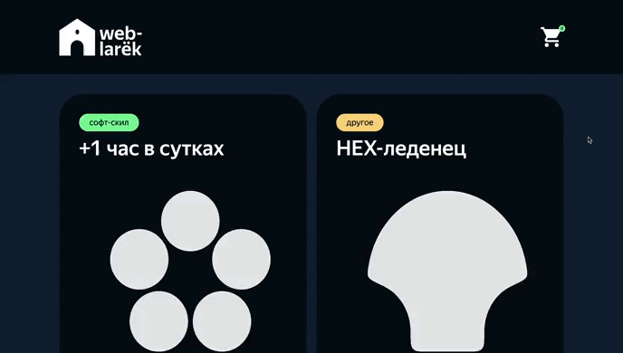

# Проектная работа "Веб-ларек"
Интернет-магазин с товарами для веб-разработчиков, в котором можно посмотреть каталог товаров, добавить товары в корзину и сделать заказ.



[Ссылка на макет Figma](https://www.figma.com/design/50YEgxY8IYDYj7UQu7yChb/%D0%92%D0%B5%D0%B1-%D0%BB%D0%B0%D1%80%D1%91%D0%BA?node-id=0-1&t=I7nbciopcfNPGAuW-0)


## Что было сделано?
1. Cпроектирована собственная реализация MVP-архитектуры веб-приложения.
2. Задокументирована спроектированная архитектура.
3. На основе базового кода реализованы компоненты и модели данных приложения.** 

## Технологии:
* HTML, SCSS, TS, Webpack

## Структура проекта:
- src/ — исходные файлы проекта
- src/components/ — папка с JS компонентами
- src/components/base/ — папка с базовым кодом

## Важные файлы:
- src/pages/index.html — HTML-файл главной страницы
- src/types/index.ts — файл с типами
- src/index.ts — точка входа приложения
- src/scss/styles.scss — корневой файл стилей
- src/utils/constants.ts — файл с константами
- src/utils/utils.ts — файл с утилитами

## Установка и запуск
Для установки и запуска проекта необходимо выполнить команды

```
npm install
npm run start
```

или

```
yarn
yarn start
```
## Сборка

```
npm run build
```

или

```
yarn build
```
## Данные и типы данных, используемые в приложении
Интерфейс, описывающий глобальное состояние приложения:
```
interface IAppState {
	catalog: IProduct[];
	basket: IProduct[];
	preview: string | null;
	order: IOrder | null;
}
```
Интерфейс для отображения главной страницы приложения:
```
interface IPage {
    counter: number;
    catalog: HTMLElement[];
    locked: boolean;
}
```
Интерфейс, описывающий данные товара:
```
interface IProduct {
    id: string;
    description: string;
    image: string;
    title: string;
    category: string;
    price: number | null;
    getId(): string;
}
```
Интерфейс для отображения карточки товара:
```
interface ICard extends IProduct {
    button?: string;
}
```
Интерфейс для отображения формы выбора способа оплаты и адреса доставки:
```
interface IOrderAddress {
    payment: string;
    address: string;
}
```
Интерфейс для отображения формы контактных данных:
```
interface IOrderContacts {
    email: string;
    phone: string;
}
```
Общий тип данных для всех форм:
```
type IOrderForm = IOrderAddress & IOrderContacts;
```
Тип данных для отображения ошибок форм:
```
type FormErrors = Partial<Record<keyof IOrder, string>>;
```
Интерфейс для отправки данных списка заказов на сервер:
```
interface IOrder {
	id: string;
	payment: string;
	email: string;
	phone: string;
	address: string;
	total: number;
	items: IProduct[];
}
```
Интерфейс, описывающий результат заказа:
```
interface IOrderResult {
    id: string[];
    total: number;
}
```
Интерфейс для отображения сообщения об успешном заказе:
```
interface ISuccess {
    total: number;
}
```
Интерфейс для отображения модального окна:
```
interface IModalData {
    content: HTMLElement;
}
``` 
Интерфейс для отображения корзины с товарами:
```
interface IBasketView {
    items: HTMLElement[];
    total: number;
    button: HTMLButtonElement;
}
```
Интерфейс данных корзины с товарами:
```
interface IBasketModel {
    items: IProduct[];
    getTotal(): number;
    add(id: IProduct): void;
    remove(id: IProduct): void;
    clearBasket(): void;
}
```
Интерфейс для отображения отдельного продукта в корзине:
```
export interface IBasketProduct {
    deleteButton: string;
    index: number;
    title: string;
    price: number;
}
```
Брокер событий:
```
interface IEventEmitter {
    emit: (event: string, data: unknown) => void;
}
```

## Архитектура приложения

Код приложения разделен на слои согласно парадигме MVP: 
- слой представления, отвечает за отображение данных на странице, 
- слой данных, отвечает за хранение и изменение данных
- презентер, отвечает за связь представления и данных.

### Базовый код

#### Класс Api
Определяет методы для выполнения HTTP-запросов GET и POST с указанным базовым URL-адресом и заголовками запросов.

Конструктор класса:
- `constructor(baseUrl: string, options: RequestInit = {})`- принимает базовый URL и глобальные опции для всех запросов(опционально).

Свойства класса:
- `baseUrl: string` — базовый URL для отправки запросов.
- `options: RequestInit` — опции для всех запросов, включая заголовки.

Методы: 
- `get` (uri: string) - выполняет GET запрос на переданный в параметрах ендпоинт и возвращает промис с объектом, которым ответил сервер
- `post` (uri: string, data: object, method: ApiPostMethods = 'POST') - принимает объект с данными, которые будут переданы в JSON в теле запроса, и отправляет эти данные на ендпоинт переданный как параметр при вызове метода. По умолчанию выполняется `POST` запрос, но метод запроса может быть переопределен заданием третьего параметра при вызове.
- `handleResponse` (response: Response) - обрабатывает ответы сервера, преобразуя их в данные формата json, если ответа нет, возвращает ошибку.

#### Класс EventEmitter
Брокер событий позволяет отправлять события и подписываться на события, происходящие в системе. Класс используется в презентере для обработки событий и в слоях приложения для генерации событий. 

Конструктор класса:
- `constructor() { this._events = new Map<EventName, Set<Subscriber>>() }` - задает свойство `_events`, которое использует `Map` для хранения обработчиков событий (ключ - имя события, значение - функции-обработчики).

Методы класса:
- `on` <T extends object>(eventName: EventName, callback: (event: T) => void) - установить обработчик на событие
- `off` (eventName: EventName, callback: Subscriber) - снять обработчик с события
- `emit` <T extends object>(eventName: string, data?: T) - инициировать событие с данными   
- `onAll` (callback: (event: EmitterEvent) => void) - установить/сбросить обработчики для всех событий
- `trigger` <T extends object>(eventName: string, context?: Partial<T>) - сделать коллбек триггер, генерирующий событие при вызове

#### Класс Model
Абстрактный базовый класс, служащий основной моделью, на основе которой создаются другие модели в приложении.

Конструктор класса:
- `constructor(data: Partial<T>, protected events: IEvents)` - принимает данные и событие.

Методы класса:
- `emitChanges` (event: string, payload?: object) - сообщает подписчикам об изменении модели и принимает два параметра: event(имя события) и payload( объект, содержащий дополнительные данные о событии).

#### Класс Component<T>
Абстрактный базовый класс для создания компонентов пользовательского интерфейса. В переменной `T` класс принимает тип данных, которые могут быть переданы в метод `render`.

Конструктор класса:
- `constructor(protected readonly container: HTMLElement) {}`- принимает только один параметр - `container`, имеющий тип `HTMLElement`.

Методы: 
- `toggleClass` (element: HTMLElement, className: string, force?: boolean) - переключает класс компонента.
- `protected setText` (element: HTMLElement, value: unknown) - устанавливает текстовое содержимое компонента.
- `setDisabled` (element: HTMLElement, state: boolean) - меняет статус блокировки компонента.
- `protected setHidden` (element: HTMLElement) - скрывает компонент.
- `protected setVisible` (element: HTMLElement) - показывает компонент.
- `protected setImage` (element: HTMLImageElement, src: string, alt?: string) - устанавливает для компонента изображение с альтернативным текстом.
- `render` (data?: Partial<T>): HTMLElement - возвращает корневой DOM-элемент.


### Слой данных

#### Класс AppState
Наследуется от базового класса Model и отвечает за хранение данных всего приложения, что позволяет отслеживать его состояние.

Конструктор класса:
- `constructor(data: Partial<IAppState>, events: IEvents)`

Поля класса:
- `basket: string[]` - список товаров, находящихся в корзине.
- `catalog: IProduct[]` - список товаров, находящихся в каталоге.
- `order: IOrder` - состояние заказа.
- `preview: string | null` - товар, открытый в модальном окне.
- `formErrors: FormErrors` - валидация форм при оформлении заказа.

Методы класса:
- `getOrderAPI()` - получает данные заказа с сервера.
- `addBasket()` - добавляет товар в корзину.
- `removeBasket()` - удаляет товар из корзину.
- `clearBasket()` - очищает всю корзину.
- `getTotal()` - определяет итоговую стоимость в корзине.
- `updateCounter()` - обновляет счётчик корзины.
- `setCatalog` ( items: ILot[ ] ) - устанавливает каталог карточек
- `setPreview` ( item: LotItem) - показывает товар в модальном окне.
- `setOrderField` ( field: keyof IOrderForm, value: string ) - устанавливает валидацию форм.
- `validateOrderAddress()` - валидация формы с адресом доставки и выбором способа оплаты.
- `validateOrderContacts()` - валидация формы с почтой и телефоном.

#### Класс Product
Отвечает за хранение данных отдельного товара. Расширяет базовый класс `Model` и вызывает его конструктор, чтобы унаследовать функционал.

Поля класса:
- `id: string` - id продукта.
- `description: string` - описание продукта.
- `image: string` - изображение продукта.
- `title: string` - название продукта.
- `category: string` - категория продукта.
- `price: number` - стоимость продукта.
- `isOrdered: boolean` - продукт заказан или не заказан.
- `index: number` - индекс продукта в корзине.

Методы класса:
- `getId(): string` - получает идентификатор конкретного товара.

### Классы представления
Все классы представления отвечают за отображение внутри контейнера (DOM-элемент) передаваемых в них данных.

#### Класс Page
Класс отвечает за формирование главной страницы приложения. 

Конструктор класса:
- `constructor(container: HTMLElement, protected events: IEvents)` - принимает элемент DOM и объект для управления событиями.

Конструктор инициализирует элементы страницы: корзину, счетчик товаров и каталог, а также, устанавливает обработчик события для клика по корзине, чтобы её открыть.

Класс `Page` определяет методы, описанные в интерфейсе `IPage`, и использует их для передачи данных в базовый класс `Component`.

Свойства класса:
- `_counter: HTMLElement` - счётчик на корзине.
- `_catalog: HTMLElement` - список карточек товаров.
- `_basket: HTMLElement` - иконка корзины.
- `_wrapper: HTMLElement` - обертка страницы.

Методы:
- `set counter` (value: number | null) - меняет счетчик корзины на главной странице, в зависимости от количества добавленных в неё товаров.
- `set catalog` (items: HTMLElement[]) - добавляет карточки товаров на страницу.
- `set locked` (value: boolean) - управляет состоянием блокировки экрана.

#### Класс Modal
Реализует отображение модального окна.

Класс `Modal` использует интерфейс `IModalData` для определения структуры данных, которая передается в базовый класс `Component`.

Конструктор класса:
`constructor(container: HTMLElement, protected events: IEvents)` - принимает DOM-элемент, в котором будет размещаться модальное окно, и объект events для обработки событий.

Свойства класса:
- `_closeButton: HTMLButtonElement` - кнопка закрытия модального окна.
- `_content: HTMLElement` - элемент контента модального окна.

Методы:
- `set content` (value: HTMLElement) - устанавливает содержимое модального окна.
- `open()` - открывает модальное окно.
- `close()` - закрывает модальное окно.
- `render` (data: IModalData): HTMLElement - реализует модальное окно на основе переданных данных и открывает его.

#### Класс Card
Отображение на странице данные карточки товара.

Конструктор класса:
`constructor(protected blockName: string, container: HTMLElement, actions?: ICardActions)` - принимает имя блока, DOM-элемент и действие.

Свойства класса:
- `_title: HTMLElement` - название товара.
- `_image?: HTMLImageElement` - изображение товара.
- `_description?: HTMLElement` - описание товара.
- `_button?: HTMLButtonElement` - кнопка действия.
- `price: number | null` - стоимость товара.
- `category: string` - категория товара.

Методы:
- `set id` (value: string) - устанавливает идентификатор товара.
- `get id()` : string - получает идентификатор товара.
- `set title` (value: string) - устанавливает название товара.
- `get title()` : string - получает название товара.
- `set image` (value: string) - устанавливает изображение товара.
- `set description` (value: string | string[]) - устанавливает описание товара.
- `set price` : number | nul - устанавливает стоимость товара.
- `set category()` : string - устанавливает категорию товара.

#### Класс Basket
Реализует отображение корзины и товаров, добавленных в неё, а также, предоставляет методы для управления ими.

Конструктор класса:
`constructor(container: HTMLElement, protected events: EventEmitter)` - для инициализации элементов корзины принимает элемент контейнера и объект для управления событиями для кнопки оформления заказа.

Свойства класса:
- `_list: HTMLElement` - элемент списка товаров в корзине.
- `_total: HTMLElement` - элемент итоговой стоимости корзины.
- `_button: HTMLElement` - элемент кнопки заказа.

Методы:
- `set items` (items: HTMLElement[]) - устанавливает список товаров в корзине.
- `set total` (total: number) - устанавливает итоговую стоимость товаров в корзине.

#### Класс Basket
Реализует отображение товаров, добавленных в корзину, а также, предоставляет методы для управления ими.

Конструктор класса:
`constructor(container: HTMLElement, actions?: IBasketActions)` - принимает элемент контейнера и действие, доступное для управление товаром в корзине.

Свойства класса:
- `protected _deleteButton: HTMLButtonElement;` - кнопка удаления товара из корзины.
- `protected _index: HTMLElement;` - индекс товара.
- `protected _title: HTMLElement;` - название товара.
- `protected _price: HTMLElement;` - стоимость товара.

Методы:
- `set title` (value: string[]) - устанавливает название товара.
- `set index` (value: number) - устанавливает индекс товара.
- `set price` (value: number) - устанавливает стоимость товара в корзине.

#### Класс Form
Предназначен для отображения формы и взаимодействия с ней.

Конструктор класса:
- `constructor(protected container: HTMLFormElement, protected events: IEvents)` - вызывает конструктор родительского класса `Component`, принимает элемент формы и объект для управления событиями.

Свойства класса:
- `_submit: HTMLButtonElement` - элемент кнопки сабмита.
- `_errors: HTMLElement` - элемент ошибки при отправке формы.

Методы:
- `onInputChange` (field: keyof T, value: string) - отслеживает изменения в полях ввода.
- `set valid` (value: boolean) - устанавливает состояние кнопки сабмита, в зависимости от наличия ошибок при заполнении формы.
- `set errors` (value: string) - устанавливает текст ошибок валидации.
- `render` (state: Partial<T> & IFormState) - устанавливает итоговое состояние формы, включая значение полей ввода и ошибок валидации.

#### Класс Success
Предназначен для отображения сообщения об успешно оформленном заказе.

Конструктор класса:
- `constructor(container: HTMLElement, actions: ISuccessActions)` - вызывает конструктор родительского класса `Component`, принимает элемент контейнера и действия, доступные при успешно оформленном заказе.

Свойства класса:
- `_close: HTMLElement` - элемент для закрытия окна.
- `total: number` - элемент итоговой стоимости заказа.

Методы:
- `set total` (total: number) - устанавливает итоговую стоимость заказа.

#### Класс OrderAddress
Класс отвечает за хранение и изменение данных пользователя при оформлении заказа. Предназначен для отображения и управления формой доставки.

Конструктор класса:
- `constructor(container: HTMLFormElement, events: IEvents)` - вызывает конструктор родительского класса `Form`, принимает элемент формы и объект для управления событиями.

Свойства класса:
- `protected _onlineButton: HTMLButtonElement` - кнопка Онлайн-заказа.
- `protected _cashButton: HTMLButtonElement` - кнопка оплаты наличными.
- `protected _paymentContainer: HTMLDivElement` - контейнер с кнопками выбора оплаты.
- `payment: string` - способ оплаты заказа, выбранный пользователем.

Методы:
- `set address` (value: string) - устанавливает адрес доставки.
- `setPayment` (field: keyof IOrderForm, value: string) - устанавливает способ оплаты.

#### Класс OrderContacts
Класс отвечает за хранение и изменение данных пользователя при оформлении заказа. Предназначен для отображения и управления формой контактов.

Конструктор класса:
- `constructor(container: HTMLFormElement, events: IEvents)` - вызывает конструктор родительского класса `Form`, принимает элемент формы и объект для управления событиями.

Свойства класса:
- `protected _button: HTMLElement` - кнопка сабмита.
- `protected _phone: string` - email пользователя.
- `protected _email: string` - номер телефона пользователя.

Методы:
- `set phone` (value: string) - устанавливает номер телефона в форме контактов.
- `set email` (value: string) - устанавливает адрес электронной поты в форме контактов.

### Слой коммуникации
### Взаимодействие компонентов
Код, описывающий взаимодействие представления и данных между собой находится в файле `index.ts`, выполняющем роль презентера. Взаимодействие осуществляется за счет событий, генерируемых с помощью брокера событий и обработчиков этих событий, описанных в `index.ts`. В `index.ts` сначала создаются экземпляры всех необходимых классов, а затем настраивается обработка событий.

***Список всех событий, которые могут генерироваться в системе:***\
- `card:select` - выбор товара для отображения в модальном окне.
- `items:changed` - изменение каталога карточек.
- `preview:changed` - изменение открытой карточки.
- `basket:open` - открытие модального окна корзины.
- `basket:changed` - изменение корзины.
- `basket:item-add` - добавление товара в корзину.
- `basket:remove` - удаление товара из корзины.
- `order:submit` - отправка формы адреса и способа оплаты.
- `order:open` - открытие формы адреса и способа оплаты.
- `order:change` - изменение одного из полей формы адреса и способа оплаты.
- `contacts:change` - изменение одного из полей формы контактов.
- `formErrors:change` - изменение состояния валидации формы адреса и способа оплаты.
- `formErrorsContacts:change` - изменение состояния валидации формы контактов.
- `success:open` - открытие окна успешного заказа.
- `success:close` - закрытие окна успешного заказа.
- `modal:open` - открытие модального окна.
- `modal:close` - закрытие модального окна.

